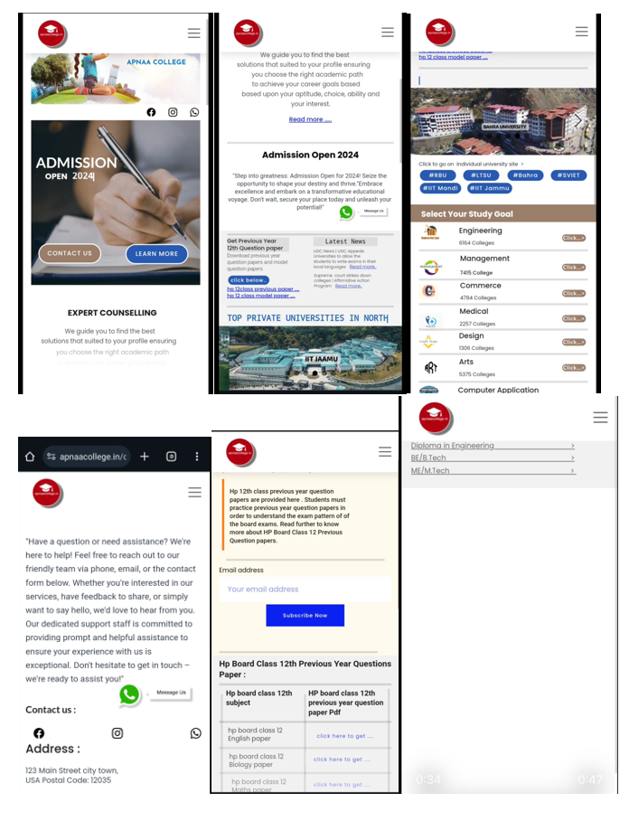

# 🎓 University Lead Generation Website

This project was created as a part of a live task assigned by the *Assistant Director of Bahra University*.  
The website helped the university *collect student information* and allowed their *counseling team to contact potential students* for admissions.
## 🖼️ Screenshot Preview

---

## 🎯 Project Objective

The aim was to provide a clean and user-friendly platform for students to:

- 🏫 Browse colleges and programs
- 🧑‍🎓 Fill out personal and academic details
- 📞 Get contacted by university counselors for guidance and admission

---

## 🧠 My Role & Skills Showcased

> 💡 *This website demonstrates my ability to design clean, responsive, and functional user interfaces using no-code/low-code tools like Hostinger Builder.*

- ✅ Skill in building structured layouts
- ✅ Focus on user experience and ease of navigation
- ✅ Ability to create real-world solutions using minimal code platforms

---

## 🎥 Demo Video

⚠️ The website is *currently not live* as the domain has expired.  
You can still watch the full working demo here:

---

## 🛠️ Tools & Tech Used

- Hostinger Website Builder (drag-and-drop platform)
- Minimal HTML/CSS where needed
- Lead form integrated with backend (email or spreadsheet)

---

## ❌ Challenges & Failure

Although the website was designed and launched successfully:

- 🔕 *Proper promotion was not done* by the university.
- 🧑‍🎓 As a result, *student traffic remained low* and lead collection was limited.
- 🌐 Eventually, the domain was *not renewed*, and the project was discontinued.

> Despite these limitations, this project gave me valuable experience in working on live projects, understanding client expectations, and building quick, functional web solutions.

---

## 📌 Project Type

🎯 *Live Campaign Project* for Bahra University (Client: Assistant Director)

---
